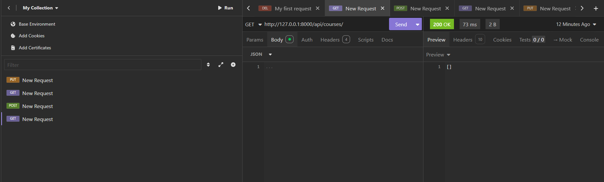

# Hands-On 3 – Django REST Framework (APIView, ViewSets & Routers)

## Overview

This hands-on demonstrates the implementation of RESTful APIs using the Django REST Framework (DRF). It covers building CRUD APIs using APIView, followed by simplifying the implementation using ModelViewSet and DefaultRouter.

---

## Objectives

- Learn the basics of Django REST Framework.
- Create REST APIs using APIView.
- Implement CRUD (Create, Read, Update, Delete) operations.
- Serialize Django models using ModelSerializer.
- Configure URL routing for REST APIs.
- Simplify API development using ModelViewSet.
- Automatically generate REST endpoints using DefaultRouter.
- Test APIs using Insomnia.

---

## Technologies Used

- Python 3.13
- Django 6.x
- Django REST Framework
- SQLite3
- Insomnia

---

## Project Structure

```
handson_03/
│
├── coursemanager/
│   ├── settings.py
│   ├── urls.py
│   └── ...
│
├── courses/
│   ├── models.py
│   ├── serializers.py
│   ├── views.py
│   ├── urls.py
│   └── ...
│
├── manage.py
├── requirements.txt
└── README.md
```

---

# Task 1 – REST API using APIView

## Description

Implemented REST APIs for the Course model using Django REST Framework's APIView class.

### Features Implemented

- Course Serializer
- List all courses
- Retrieve a course by ID
- Create a new course
- Update an existing course
- Delete a course

### API Endpoints

| Method | Endpoint | Description |
|---------|----------|-------------|
| GET | `/api/courses/` | Retrieve all courses |
| POST | `/api/courses/` | Create a new course |
| GET | `/api/courses/<id>/` | Retrieve a course |
| PUT | `/api/courses/<id>/` | Update a course |
| DELETE | `/api/courses/<id>/` | Delete a course |

---

# Task 2 – ViewSets and Routers

## Description

Replaced APIView implementation with Django REST Framework's ModelViewSet and configured automatic URL routing using DefaultRouter.

### Features Implemented

- ModelViewSet
- DefaultRouter
- Automatic CRUD operations
- Cleaner and reusable code

### API Endpoints Generated Automatically

| Method | Endpoint | Description |
|---------|----------|-------------|
| GET | `/api/courses/` | Retrieve all courses |
| POST | `/api/courses/` | Create a new course |
| GET | `/api/courses/<id>/` | Retrieve course by ID |
| PUT | `/api/courses/<id>/` | Update course |
| DELETE | `/api/courses/<id>/` | Delete course |

---

## Models Used

### Department

- name
- head_of_dept
- budget

### Course

- name
- code
- credits
- department (ForeignKey)

### Student

- first_name
- last_name
- email
- department
- enrollment_year

### Enrollment

- student
- course
- enrollment_date
- grade

---

## Testing

The APIs were tested successfully using **Insomnia**.

The following operations were verified:

- GET
- POST
- PUT
- DELETE

---

## Packages Used

```
Django
djangorestframework
```

---

## Installation

Clone the repository

```bash
git clone https://github.com/kalvimathi/PythonBackendFrameworks.git
```

Navigate to the project

```bash
cd PythonBackendFrameworks/kalvimathi/handson_03
```

Create a virtual environment

```bash
python -m venv venv
```

Activate the virtual environment

### Windows

```bash
venv\Scripts\activate
```

Install dependencies

```bash
pip install -r requirements.txt
```

Apply migrations

```bash
python manage.py makemigrations
python manage.py migrate
```

Run the development server

```bash
python manage.py runserver
```
# output
   


---

## Learning Outcomes

After completing this hands-on, the following concepts were understood:

- Django REST Framework fundamentals
- APIView
- ModelSerializer
- CRUD API development
- URL routing
- ModelViewSet
- DefaultRouter
- REST API testing using Insomnia

---

## Author

**Kalvimathi**

Python Backend Frameworks – Hands-On 3